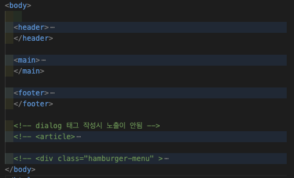
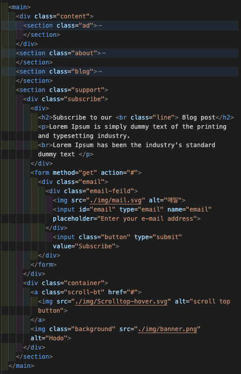
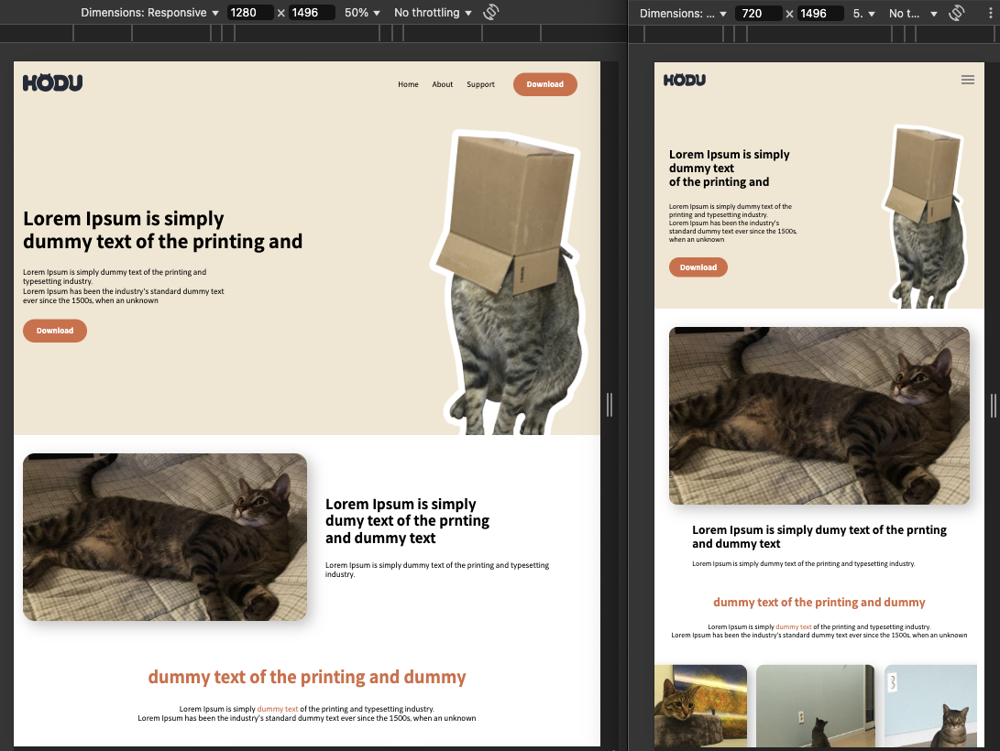
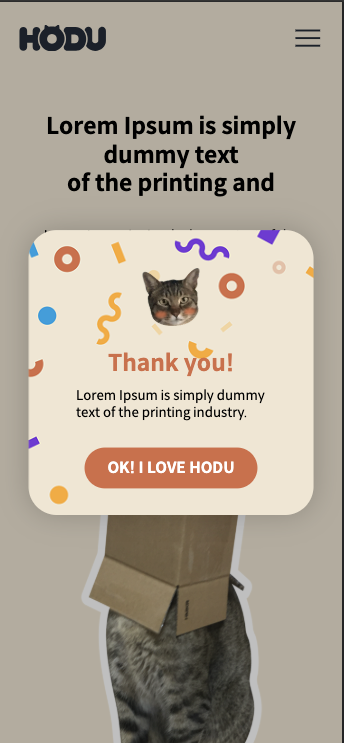

# landingpage

---

# 🐾 HODU Landing Page

**HODU Landing Page**는 반응형 웹 기반의 심플하고 직관적인 랜딩 페이지 프로젝트입니다. HTML과 CSS만으로 제작되었으며, 다양한 해상도에 대응하는 유연한 구조와 레이아웃을 가지고 있습니다.

## 📂 파일 구조

```C
├─ index.html
├─ style
│    ├─ style.css
│    ├─ style-phone.css
│    └─ style-responsive.css
├─ img
├─ font.css
└─ reset.css
```

## ✨ 주요 특징

- 반응형 웹 디자인 구현 (`media query` 활용)
- 모바일 뷰 최적화 (`style-phone.css`)
- 1280px 이하 해상도 대응 (`style-responsive.css`)

## 🛠 기술 스택

- HTML5
- CSS3 (반응형 + Flexbox)


## 작업 사항

* 노션을 통해 공유된 요구사항 명세 및 Figma 디자인 적용

* 시멘틱 마크업을 최대한 작성



* 반응형 웹 구현을 위해 공유된 디자인 외 1280px, 720px 기준화면을 추가


* 스크롤 헤더의 경우 모든 해상도에서 고정으로 처리,720px 이하 해상도부터 메뉴 버튼으로 전환


* 모달창 및 모바일 해상도 hamburger menu 또한 구현 완료하였으며, 현재 주석처리한 상태


## 구현 한계 및 학습 방향

* Position/Flex에 대한 이해 부족

* Overflow에 대한 학습 부족으로 미완성 구현

* class명 작성이 미숙하여 수정 및 관리가 어려움

* Form 태그에 대한 학습과 이해가 필요
